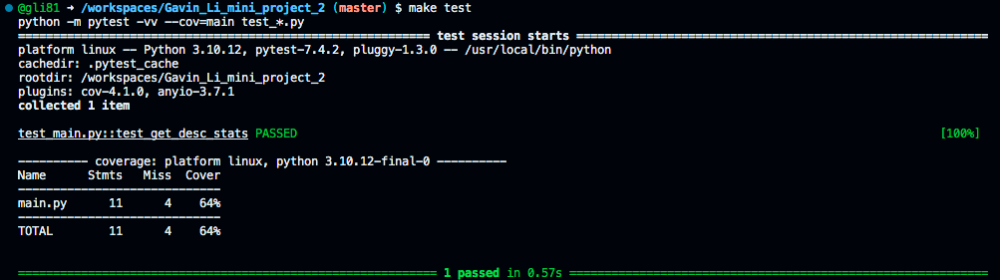

# IDS 706 Data Engineering Mini Project 1 

This repo is for Duke MIDS IDS706 Data Engineering course. It contains a Dockerfile that builds a codespace environment and sets up vscode in that environment. A Makefile is also run to perform Github Actions: `make install`, `make test`, `make format`, `make lint`

## Purpose of the template

This template serves as the base repository for future projects in the class.

## The build process

### Install python packages

`make install`

calls the following commands

`pip install --upgrade pip && pip install -r requirements.txt`

### Test the code

`make test`

calls the following command

`python -m pytest -vv --cov=main test_*.py`

### Lint the code

`make lint`

calls the following command

`pylint --disable=R,C --ignore-patterns=test_.*?py *.py`

## References

[Professor Noah's template](https://github.com/nogibjj/python-template)