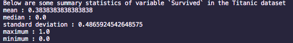
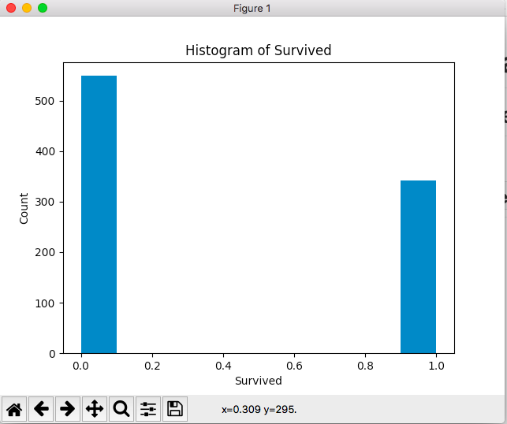

# IDS 706 Data Engineering Mini Project 2 

This repo is for Duke MIDS IDS706 Data Engineering course. The environment was based on the first mini project. The repo also includes descriptive statistical analysis of Titanic dataset from kaggle.com

## Purpose of the template

The work in this repo includes descriptive statistical analysis on dataset [TITANIC from kaggle](https://www.kaggle.com/competitions/titanic/overview)

## The build process

### Install python packages

`make install`

calls the following commands

`pip install --upgrade pip && pip install -r requirements.txt`

### Test the code

`make test`

calls the following command

`python -m pytest -vv --cov=main test_*.py`

### Lint the code

`make lint`

calls the following command

`pylint --disable=R,C --ignore-patterns=test_.*?py *.py`

‘

## Descriptive Statistics using Python Pandas

1. Read the csv file at `./dataset/train.csv` using `pandas.read_csv()`

2. Generated summary statistics using `.describe()` method. The result is as follow:

3. Created histogram using `matplotlib.pyplot.hist()` method, added labels and title to the plot. The result is as follow:

